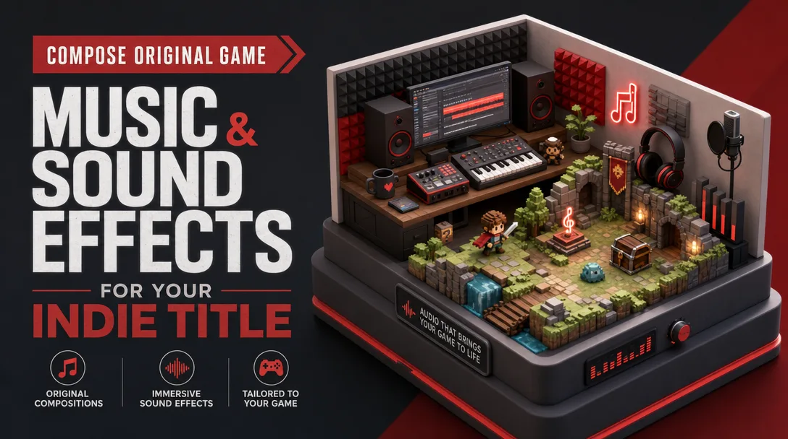

# mmo — game-art image prompts

Image-generation prompts for game / MMO marketplace thumbnails.
Each prompt targets an image model (e.g. `fal-ai/gpt-image-2`), 16:9, no baked price/currency.

## Game audio — isometric pixel-game diorama

A cohesive isometric hero scene fusing a game-audio studio with a retro pixel-art game world, on a
console-style pedestal, bold left-side typography, red & charcoal palette.

→ Full prompt + seed template: [`game-audio-diorama.md`](./game-audio-diorama.md)
