# Block (voxel) diorama prompts (game / MMO)

20 game/MMO scenes in a shared **3D isometric chunky-BLOCK (voxel)** style (bold simple cube blocks, 
tilt-shift miniature on a pedestal). Generated with `fal-ai/gpt-image-2`, 16:9.

## town-square 

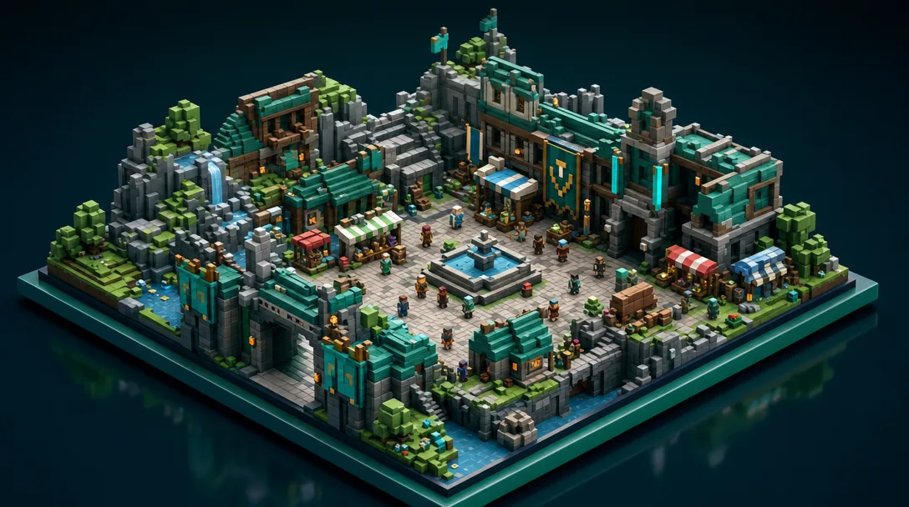

> A richly-detailed 3D ISOMETRIC DIORAMA, a game world built out of smooth 3D BLOCKS of MIXED, NON-UNIFORM sizes — big chunky blocks for the large masses (walls, terrain, roofs) combined with many small blocks for fine detail (windows, props, characters, foliage, trim), all clean smooth cube/box shapes with NO studs and NO bumps, sitting on a glossy pedestal base: a fantasy MMO town square with a fountain, market stalls, banners and tiny adventurer NPCs. Dense, intricate blocky build with lots of little blocks adding texture and depth, varied block scale, tilt-shift miniature feel, premium crisp studio render, main-hero level of detail. 16:9 widescreen composition. Cohesive emerald and teal color grade, soft studio lighting, soft long shadows, dark premium background. No text, no price, no currency.

## dungeon-boss 

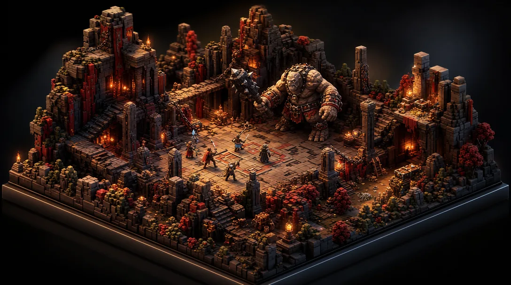

> A richly-detailed 3D ISOMETRIC DIORAMA, a game world built out of smooth 3D BLOCKS of MIXED, NON-UNIFORM sizes — big chunky blocks for the large masses (walls, terrain, roofs) combined with many small blocks for fine detail (windows, props, characters, foliage, trim), all clean smooth cube/box shapes with NO studs and NO bumps, sitting on a glossy pedestal base: a torch-lit dungeon boss arena with a giant ogre, broken pillars, treasure and a hero party. Dense, intricate blocky build with lots of little blocks adding texture and depth, varied block scale, tilt-shift miniature feel, premium crisp studio render, main-hero level of detail. 16:9 widescreen composition. Cohesive red and charcoal color grade, soft studio lighting, soft long shadows, dark premium background. No text, no price, no currency.

## sky-island 

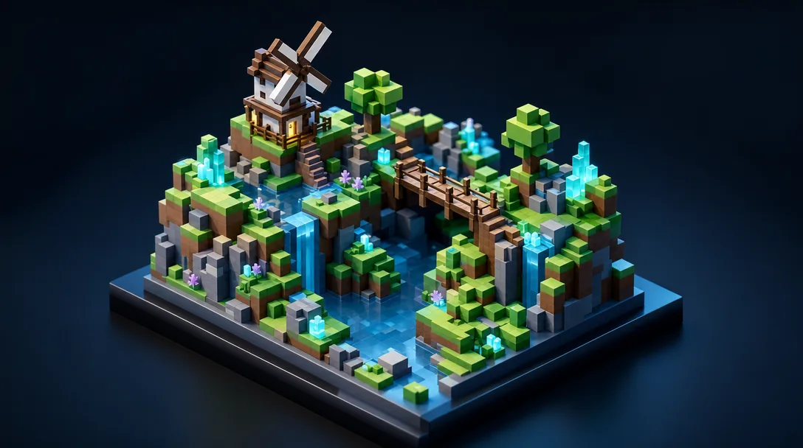

> A richly-detailed 3D ISOMETRIC DIORAMA, a game world built out of smooth 3D BLOCKS of MIXED, NON-UNIFORM sizes — big chunky blocks for the large masses (walls, terrain, roofs) combined with many small blocks for fine detail (windows, props, characters, foliage, trim), all clean smooth cube/box shapes with NO studs and NO bumps, sitting on a glossy pedestal base: a floating sky island with waterfalls, a windmill, glowing crystals and a wooden bridge. Dense, intricate blocky build with lots of little blocks adding texture and depth, varied block scale, tilt-shift miniature feel, premium crisp studio render, main-hero level of detail. 16:9 widescreen composition. Cohesive sky-blue and mint color grade, soft studio lighting, soft long shadows, dark premium background. No text, no price, no currency.

## pirate-cove 

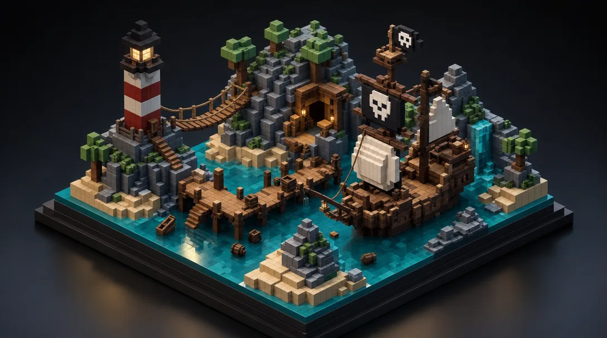

> A richly-detailed 3D ISOMETRIC DIORAMA, a game world built out of smooth 3D BLOCKS of MIXED, NON-UNIFORM sizes — big chunky blocks for the large masses (walls, terrain, roofs) combined with many small blocks for fine detail (windows, props, characters, foliage, trim), all clean smooth cube/box shapes with NO studs and NO bumps, sitting on a glossy pedestal base: a pirate cove harbor with a docked galleon, barrels, a lighthouse and rope bridges. Dense, intricate blocky build with lots of little blocks adding texture and depth, varied block scale, tilt-shift miniature feel, premium crisp studio render, main-hero level of detail. 16:9 widescreen composition. Cohesive ocean-teal and sand color grade, soft studio lighting, soft long shadows, dark premium background. No text, no price, no currency.

## magic-academy 

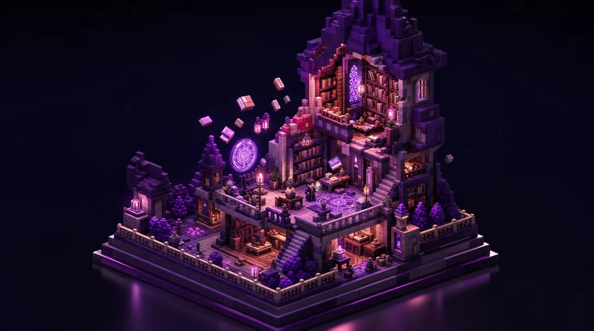

> A richly-detailed 3D ISOMETRIC DIORAMA, a game world built out of smooth 3D BLOCKS of MIXED, NON-UNIFORM sizes — big chunky blocks for the large masses (walls, terrain, roofs) combined with many small blocks for fine detail (windows, props, characters, foliage, trim), all clean smooth cube/box shapes with NO studs and NO bumps, sitting on a glossy pedestal base: a magic academy library tower with floating books, spell circles and arcane lanterns. Dense, intricate blocky build with lots of little blocks adding texture and depth, varied block scale, tilt-shift miniature feel, premium crisp studio render, main-hero level of detail. 16:9 widescreen composition. Cohesive violet and fuchsia color grade, soft studio lighting, soft long shadows, dark premium background. No text, no price, no currency.

## blacksmith-forge 

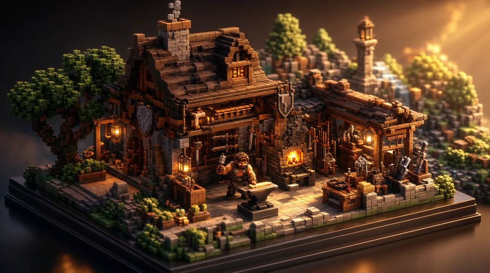

> A richly-detailed 3D ISOMETRIC DIORAMA, a game world built out of smooth 3D BLOCKS of MIXED, NON-UNIFORM sizes — big chunky blocks for the large masses (walls, terrain, roofs) combined with many small blocks for fine detail (windows, props, characters, foliage, trim), all clean smooth cube/box shapes with NO studs and NO bumps, sitting on a glossy pedestal base: a blacksmith forge workshop with a glowing anvil, weapon racks, a furnace and sparks. Dense, intricate blocky build with lots of little blocks adding texture and depth, varied block scale, tilt-shift miniature feel, premium crisp studio render, main-hero level of detail. 16:9 widescreen composition. Cohesive amber and brown color grade, soft studio lighting, soft long shadows, dark premium background. No text, no price, no currency.

## cozy-tavern 

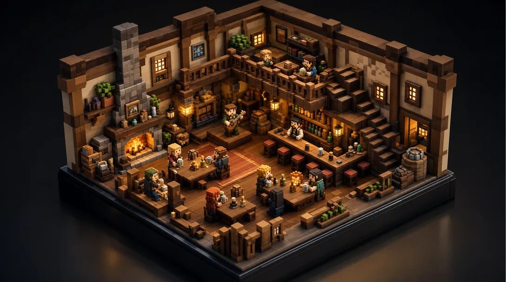

> A richly-detailed 3D ISOMETRIC DIORAMA, a game world built out of smooth 3D BLOCKS of MIXED, NON-UNIFORM sizes — big chunky blocks for the large masses (walls, terrain, roofs) combined with many small blocks for fine detail (windows, props, characters, foliage, trim), all clean smooth cube/box shapes with NO studs and NO bumps, sitting on a glossy pedestal base: a cozy fantasy tavern interior with a fireplace, mugs, a bard and wooden tables. Dense, intricate blocky build with lots of little blocks adding texture and depth, varied block scale, tilt-shift miniature feel, premium crisp studio render, main-hero level of detail. 16:9 widescreen composition. Cohesive warm neutral and black color grade, soft studio lighting, soft long shadows, dark premium background. No text, no price, no currency.

## dragon-lair 

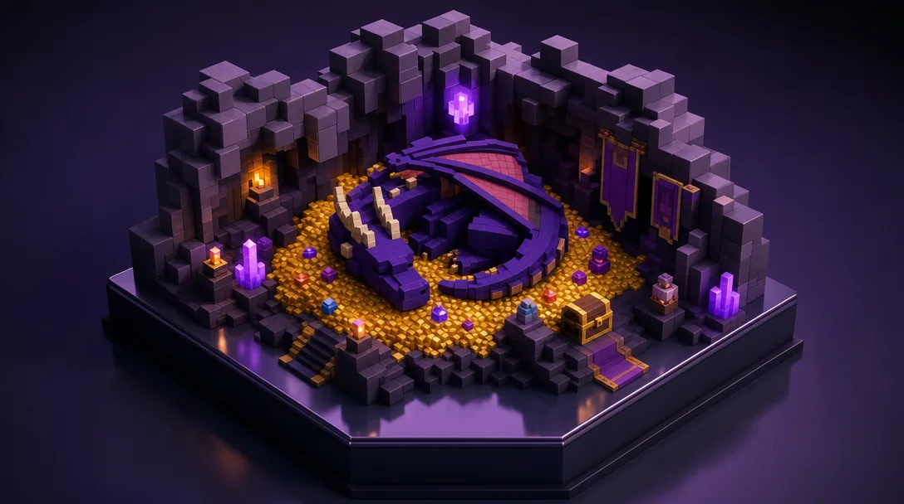

> A richly-detailed 3D ISOMETRIC DIORAMA, a game world built out of smooth 3D BLOCKS of MIXED, NON-UNIFORM sizes — big chunky blocks for the large masses (walls, terrain, roofs) combined with many small blocks for fine detail (windows, props, characters, foliage, trim), all clean smooth cube/box shapes with NO studs and NO bumps, sitting on a glossy pedestal base: a dragon's lair with a sleeping dragon coiled on a hoard of gold coins and gems. Dense, intricate blocky build with lots of little blocks adding texture and depth, varied block scale, tilt-shift miniature feel, premium crisp studio render, main-hero level of detail. 16:9 widescreen composition. Cohesive purple and gold color grade, soft studio lighting, soft long shadows, dark premium background. No text, no price, no currency.

## harvest-farm 

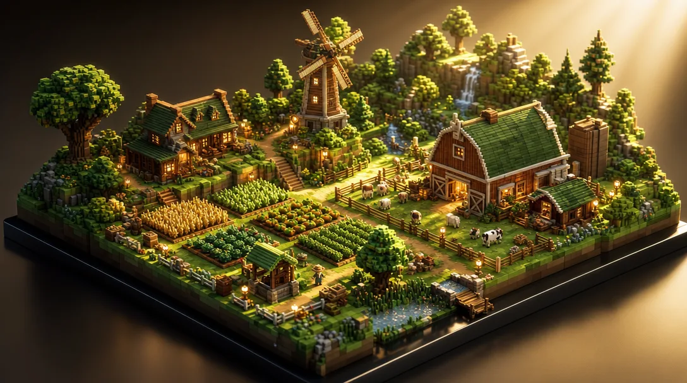

> A richly-detailed 3D ISOMETRIC DIORAMA, a game world built out of smooth 3D BLOCKS of MIXED, NON-UNIFORM sizes — big chunky blocks for the large masses (walls, terrain, roofs) combined with many small blocks for fine detail (windows, props, characters, foliage, trim), all clean smooth cube/box shapes with NO studs and NO bumps, sitting on a glossy pedestal base: a farming homestead diorama with crop fields, a barn, a windmill and grazing animals. Dense, intricate blocky build with lots of little blocks adding texture and depth, varied block scale, tilt-shift miniature feel, premium crisp studio render, main-hero level of detail. 16:9 widescreen composition. Cohesive lime and forest-green color grade, soft studio lighting, soft long shadows, dark premium background. No text, no price, no currency.

## spaceport-hangar 

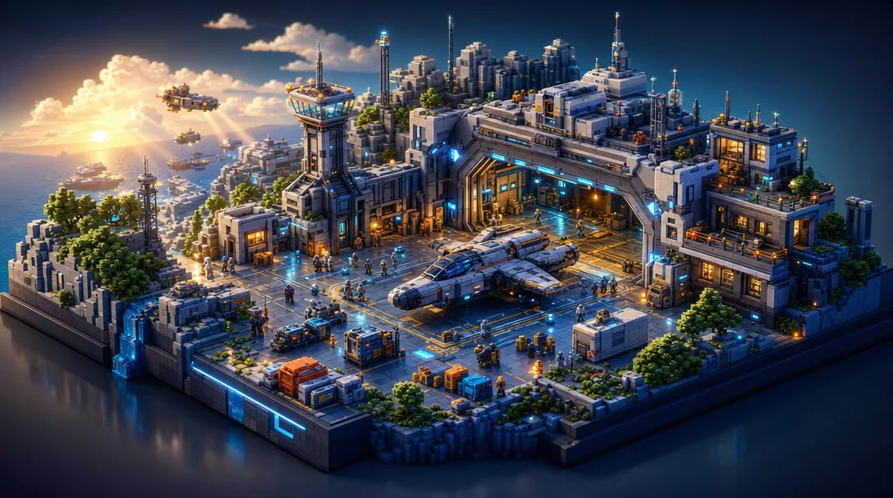

> A richly-detailed 3D ISOMETRIC DIORAMA, a game world built out of smooth 3D BLOCKS of MIXED, NON-UNIFORM sizes — big chunky blocks for the large masses (walls, terrain, roofs) combined with many small blocks for fine detail (windows, props, characters, foliage, trim), all clean smooth cube/box shapes with NO studs and NO bumps, sitting on a glossy pedestal base: a sci-fi spaceport hangar with a docked starship, robots, crates and neon gantries. Dense, intricate blocky build with lots of little blocks adding texture and depth, varied block scale, tilt-shift miniature feel, premium crisp studio render, main-hero level of detail. 16:9 widescreen composition. Cohesive cyan and navy color grade, soft studio lighting, soft long shadows, dark premium background. No text, no price, no currency.

## cyber-market 

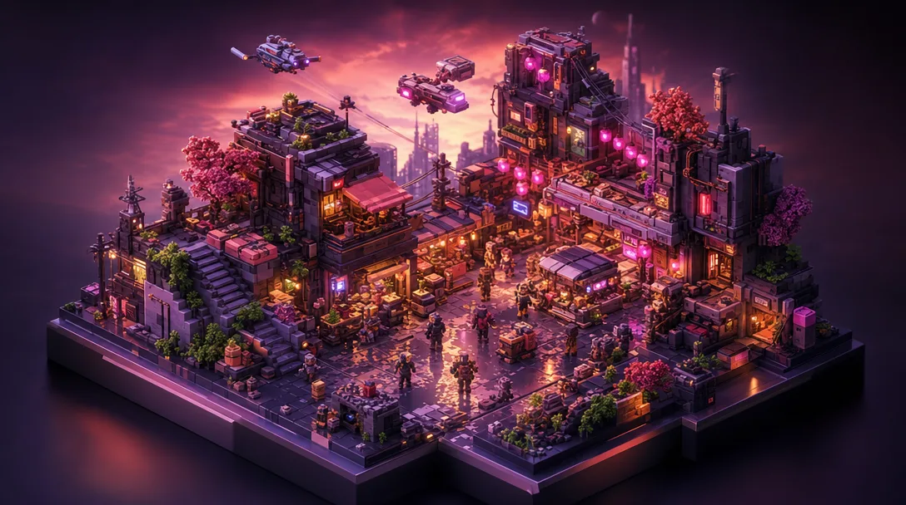

> A richly-detailed 3D ISOMETRIC DIORAMA, a game world built out of smooth 3D BLOCKS of MIXED, NON-UNIFORM sizes — big chunky blocks for the large masses (walls, terrain, roofs) combined with many small blocks for fine detail (windows, props, characters, foliage, trim), all clean smooth cube/box shapes with NO studs and NO bumps, sitting on a glossy pedestal base: a cyberpunk street market alley with neon signs, food stalls, drones and rain puddles. Dense, intricate blocky build with lots of little blocks adding texture and depth, varied block scale, tilt-shift miniature feel, premium crisp studio render, main-hero level of detail. 16:9 widescreen composition. Cohesive magenta and plum color grade, soft studio lighting, soft long shadows, dark premium background. No text, no price, no currency.

## coral-ruins 

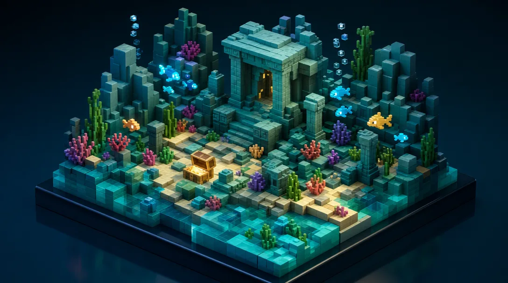

> A richly-detailed 3D ISOMETRIC DIORAMA, a game world built out of smooth 3D BLOCKS of MIXED, NON-UNIFORM sizes — big chunky blocks for the large masses (walls, terrain, roofs) combined with many small blocks for fine detail (windows, props, characters, foliage, trim), all clean smooth cube/box shapes with NO studs and NO bumps, sitting on a glossy pedestal base: an underwater coral ruin with sunken temple columns, glowing fish and a treasure chest. Dense, intricate blocky build with lots of little blocks adding texture and depth, varied block scale, tilt-shift miniature feel, premium crisp studio render, main-hero level of detail. 16:9 widescreen composition. Cohesive ocean-teal and sand color grade, soft studio lighting, soft long shadows, dark premium background. No text, no price, no currency.

## haunted-crypt 

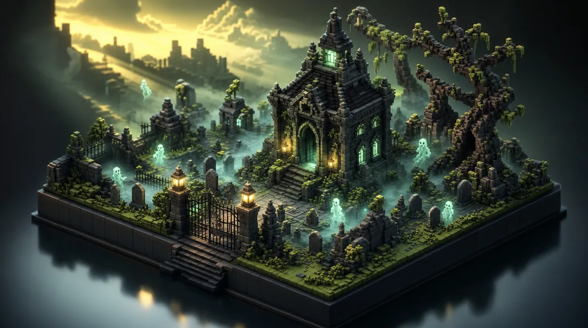

> A richly-detailed 3D ISOMETRIC DIORAMA, a game world built out of smooth 3D BLOCKS of MIXED, NON-UNIFORM sizes — big chunky blocks for the large masses (walls, terrain, roofs) combined with many small blocks for fine detail (windows, props, characters, foliage, trim), all clean smooth cube/box shapes with NO studs and NO bumps, sitting on a glossy pedestal base: a haunted graveyard crypt with gravestones, fog, glowing ghosts and a gnarled tree. Dense, intricate blocky build with lots of little blocks adding texture and depth, varied block scale, tilt-shift miniature feel, premium crisp studio render, main-hero level of detail. 16:9 widescreen composition. Cohesive graphite and lime color grade, soft studio lighting, soft long shadows, dark premium background. No text, no price, no currency.

## arena-colosseum 

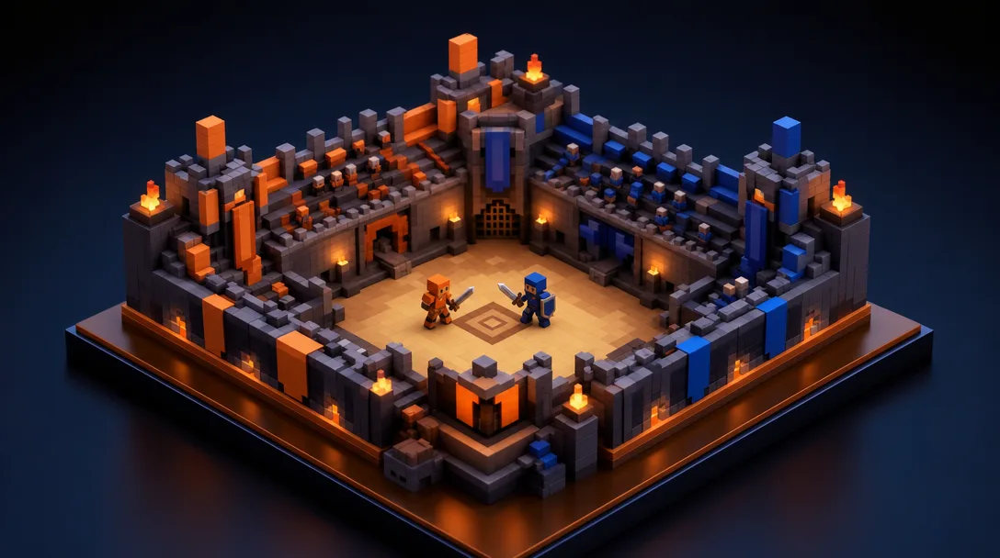

> A richly-detailed 3D ISOMETRIC DIORAMA, a game world built out of smooth 3D BLOCKS of MIXED, NON-UNIFORM sizes — big chunky blocks for the large masses (walls, terrain, roofs) combined with many small blocks for fine detail (windows, props, characters, foliage, trim), all clean smooth cube/box shapes with NO studs and NO bumps, sitting on a glossy pedestal base: a PvP arena colosseum with tiered stands, two gladiators, banners and torches. Dense, intricate blocky build with lots of little blocks adding texture and depth, varied block scale, tilt-shift miniature feel, premium crisp studio render, main-hero level of detail. 16:9 widescreen composition. Cohesive tangerine and indigo color grade, soft studio lighting, soft long shadows, dark premium background. No text, no price, no currency.

## alchemy-lab 

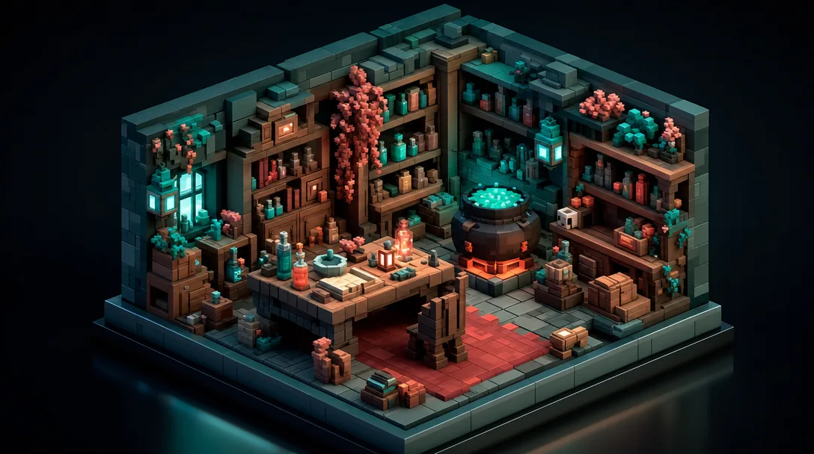

> A richly-detailed 3D ISOMETRIC DIORAMA, a game world built out of smooth 3D BLOCKS of MIXED, NON-UNIFORM sizes — big chunky blocks for the large masses (walls, terrain, roofs) combined with many small blocks for fine detail (windows, props, characters, foliage, trim), all clean smooth cube/box shapes with NO studs and NO bumps, sitting on a glossy pedestal base: an alchemy lab workbench with bubbling potions, shelves of ingredients and a cauldron. Dense, intricate blocky build with lots of little blocks adding texture and depth, varied block scale, tilt-shift miniature feel, premium crisp studio render, main-hero level of detail. 16:9 widescreen composition. Cohesive teal and coral color grade, soft studio lighting, soft long shadows, dark premium background. No text, no price, no currency.

## guild-hall 

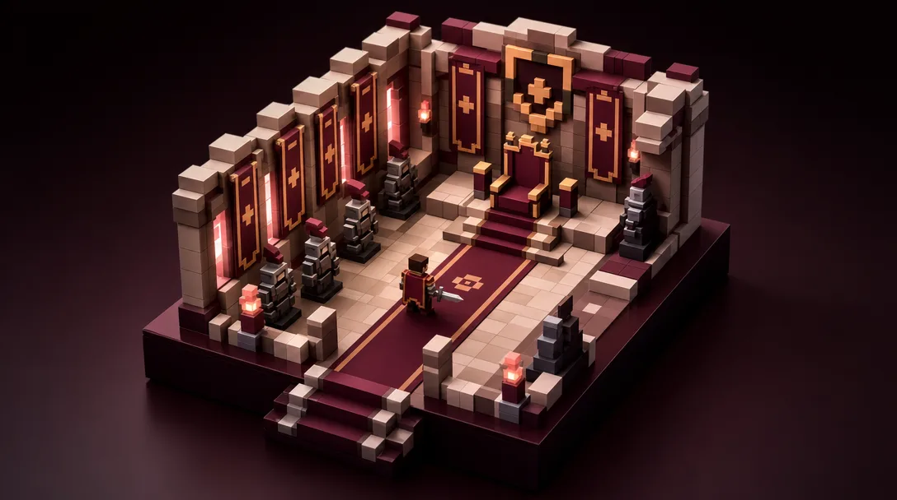

> A richly-detailed 3D ISOMETRIC DIORAMA, a game world built out of smooth 3D BLOCKS of MIXED, NON-UNIFORM sizes — big chunky blocks for the large masses (walls, terrain, roofs) combined with many small blocks for fine detail (windows, props, characters, foliage, trim), all clean smooth cube/box shapes with NO studs and NO bumps, sitting on a glossy pedestal base: a guild hall throne room with a banner-lined hall, a throne, armor stands and a hero. Dense, intricate blocky build with lots of little blocks adding texture and depth, varied block scale, tilt-shift miniature feel, premium crisp studio render, main-hero level of detail. 16:9 widescreen composition. Cohesive burgundy and blush color grade, soft studio lighting, soft long shadows, dark premium background. No text, no price, no currency.

## snowy-fortress 

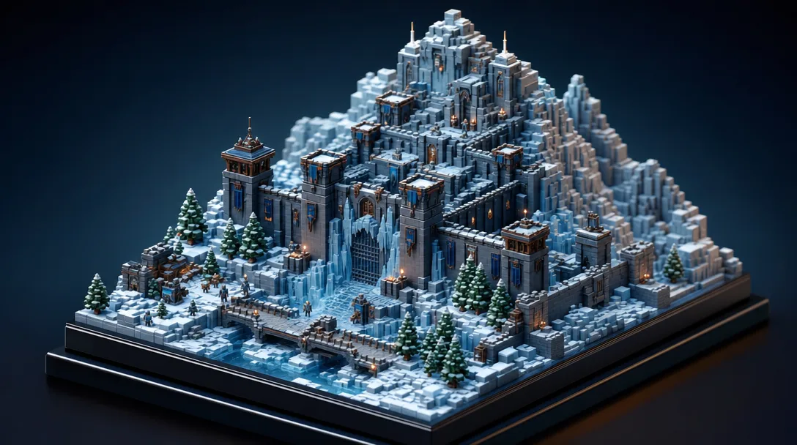

> A richly-detailed 3D ISOMETRIC DIORAMA, a game world built out of smooth 3D BLOCKS of MIXED, NON-UNIFORM sizes — big chunky blocks for the large masses (walls, terrain, roofs) combined with many small blocks for fine detail (windows, props, characters, foliage, trim), all clean smooth cube/box shapes with NO studs and NO bumps, sitting on a glossy pedestal base: a snowy mountain fortress with stone walls, watchtowers, pine trees and a frozen gate. Dense, intricate blocky build with lots of little blocks adding texture and depth, varied block scale, tilt-shift miniature feel, premium crisp studio render, main-hero level of detail. 16:9 widescreen composition. Cohesive steel-blue and copper color grade, soft studio lighting, soft long shadows, dark premium background. No text, no price, no currency.

## desert-oasis 

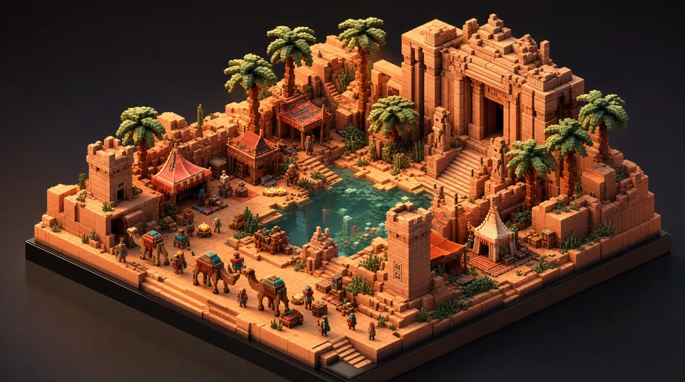

> A richly-detailed 3D ISOMETRIC DIORAMA, a game world built out of smooth 3D BLOCKS of MIXED, NON-UNIFORM sizes — big chunky blocks for the large masses (walls, terrain, roofs) combined with many small blocks for fine detail (windows, props, characters, foliage, trim), all clean smooth cube/box shapes with NO studs and NO bumps, sitting on a glossy pedestal base: a desert oasis caravan camp with palm trees, tents, camels and a ruined temple. Dense, intricate blocky build with lots of little blocks adding texture and depth, varied block scale, tilt-shift miniature feel, premium crisp studio render, main-hero level of detail. 16:9 widescreen composition. Cohesive peach and terracotta color grade, soft studio lighting, soft long shadows, dark premium background. No text, no price, no currency.

## pixel-forest 

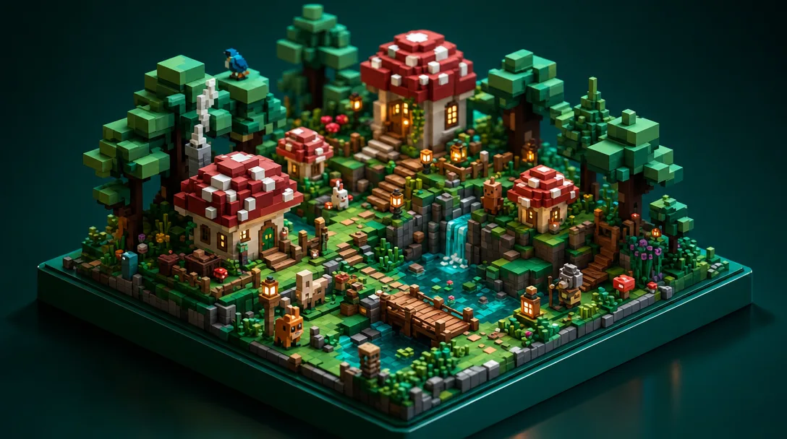

> A richly-detailed 3D ISOMETRIC DIORAMA, a game world built out of smooth 3D BLOCKS of MIXED, NON-UNIFORM sizes — big chunky blocks for the large masses (walls, terrain, roofs) combined with many small blocks for fine detail (windows, props, characters, foliage, trim), all clean smooth cube/box shapes with NO studs and NO bumps, sitting on a glossy pedestal base: a pixel-art forest village with mushroom houses, a stream, lanterns and woodland critters. Dense, intricate blocky build with lots of little blocks adding texture and depth, varied block scale, tilt-shift miniature feel, premium crisp studio render, main-hero level of detail. 16:9 widescreen composition. Cohesive emerald and teal color grade, soft studio lighting, soft long shadows, dark premium background. No text, no price, no currency.

## overworld-map 

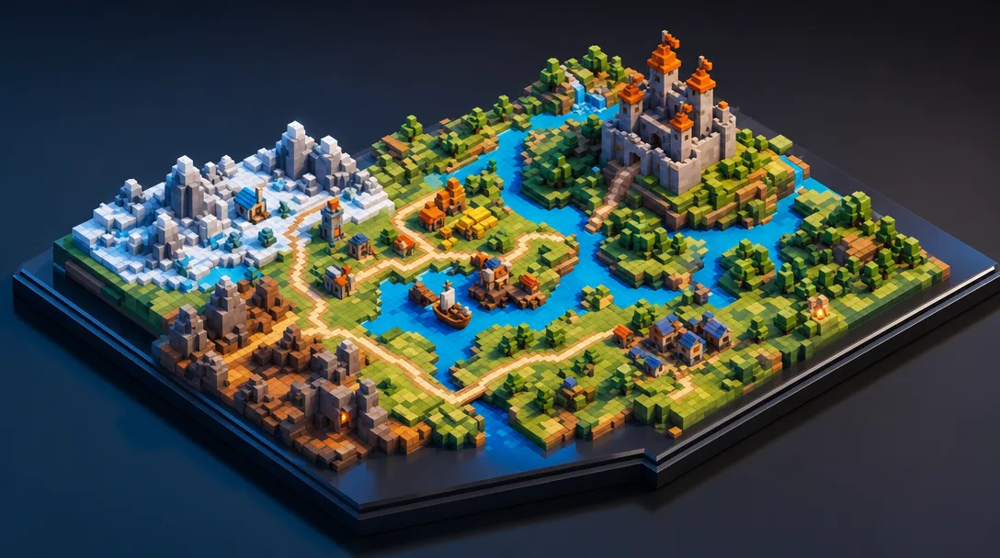

> A richly-detailed 3D ISOMETRIC DIORAMA, a game world built out of smooth 3D BLOCKS of MIXED, NON-UNIFORM sizes — big chunky blocks for the large masses (walls, terrain, roofs) combined with many small blocks for fine detail (windows, props, characters, foliage, trim), all clean smooth cube/box shapes with NO studs and NO bumps, sitting on a glossy pedestal base: a top-down RPG overworld map board with tiny mountains, towns, a winding road and a castle. Dense, intricate blocky build with lots of little blocks adding texture and depth, varied block scale, tilt-shift miniature feel, premium crisp studio render, main-hero level of detail. 16:9 widescreen composition. Cohesive blue and orange color grade, soft studio lighting, soft long shadows, dark premium background. No text, no price, no currency.
