# Block (voxel) diorama prompts (game / MMO)

20 game/MMO scenes in a shared **3D isometric chunky-BLOCK (voxel)** style (bold simple cube blocks, 
tilt-shift miniature on a pedestal). Generated with `fal-ai/gpt-image-2`, 16:9.

## town-square 

> A richly-detailed 3D ISOMETRIC DIORAMA, an OPEN-AIR OUTDOOR game world built out of smooth 3D BLOCKS of MIXED, NON-UNIFORM sizes — big chunky blocks for the large masses (walls, terrain, roofs) combined with many small blocks for fine detail (windows, props, foliage, trim). Characters and creatures are finely subdivided into MANY TINY BLOCKS with rounded, detailed, well-proportioned shapes — NOT big cubic Minecraft-style heads, avoid oversized square blocky heads, keep small smooth high-resolution multi-block figures. All clean smooth cube/box shapes with NO studs and NO bumps, sitting on a glossy pedestal base: a fantasy MMO town square with a fountain, market stalls, banners and tiny adventurer NPCs. Expansive outdoor scene with open sky and depth, dense intricate blocky build with lots of little blocks adding texture, varied block scale, dramatic CINEMATIC LIGHTING — warm golden-hour key light, glowing lanterns and light sources casting soft pools of light, bright rim light and gentle bloom, atmospheric god-rays, tilt-shift miniature feel, premium crisp studio render, main-hero level of detail. 16:9 widescreen composition. Cohesive emerald and teal color grade, soft studio lighting, soft long shadows, dark premium background. No text, no price, no currency.

## dungeon-boss 

> A richly-detailed 3D ISOMETRIC DIORAMA, an OPEN-AIR OUTDOOR game world built out of smooth 3D BLOCKS of MIXED, NON-UNIFORM sizes — big chunky blocks for the large masses (walls, terrain, roofs) combined with many small blocks for fine detail (windows, props, foliage, trim). Characters and creatures are finely subdivided into MANY TINY BLOCKS with rounded, detailed, well-proportioned shapes — NOT big cubic Minecraft-style heads, avoid oversized square blocky heads, keep small smooth high-resolution multi-block figures. All clean smooth cube/box shapes with NO studs and NO bumps, sitting on a glossy pedestal base: a torch-lit dungeon boss arena with a giant ogre, broken pillars, treasure and a hero party. Expansive outdoor scene with open sky and depth, dense intricate blocky build with lots of little blocks adding texture, varied block scale, dramatic CINEMATIC LIGHTING — warm golden-hour key light, glowing lanterns and light sources casting soft pools of light, bright rim light and gentle bloom, atmospheric god-rays, tilt-shift miniature feel, premium crisp studio render, main-hero level of detail. 16:9 widescreen composition. Cohesive red and charcoal color grade, soft studio lighting, soft long shadows, dark premium background. No text, no price, no currency.

## sky-island 

> A richly-detailed 3D ISOMETRIC DIORAMA, an OPEN-AIR OUTDOOR game world built out of smooth 3D BLOCKS of MIXED, NON-UNIFORM sizes — big chunky blocks for the large masses (walls, terrain, roofs) combined with many small blocks for fine detail (windows, props, foliage, trim). Characters and creatures are finely subdivided into MANY TINY BLOCKS with rounded, detailed, well-proportioned shapes — NOT big cubic Minecraft-style heads, avoid oversized square blocky heads, keep small smooth high-resolution multi-block figures. All clean smooth cube/box shapes with NO studs and NO bumps, sitting on a glossy pedestal base: a floating sky island with waterfalls, a windmill, glowing crystals and a wooden bridge. Expansive outdoor scene with open sky and depth, dense intricate blocky build with lots of little blocks adding texture, varied block scale, dramatic CINEMATIC LIGHTING — warm golden-hour key light, glowing lanterns and light sources casting soft pools of light, bright rim light and gentle bloom, atmospheric god-rays, tilt-shift miniature feel, premium crisp studio render, main-hero level of detail. 16:9 widescreen composition. Cohesive sky-blue and mint color grade, soft studio lighting, soft long shadows, dark premium background. No text, no price, no currency.

## pirate-cove 

> A richly-detailed 3D ISOMETRIC DIORAMA, an OPEN-AIR OUTDOOR game world built out of smooth 3D BLOCKS of MIXED, NON-UNIFORM sizes — big chunky blocks for the large masses (walls, terrain, roofs) combined with many small blocks for fine detail (windows, props, foliage, trim). Characters and creatures are finely subdivided into MANY TINY BLOCKS with rounded, detailed, well-proportioned shapes — NOT big cubic Minecraft-style heads, avoid oversized square blocky heads, keep small smooth high-resolution multi-block figures. All clean smooth cube/box shapes with NO studs and NO bumps, sitting on a glossy pedestal base: a pirate cove harbor with a docked galleon, barrels, a lighthouse and rope bridges. Expansive outdoor scene with open sky and depth, dense intricate blocky build with lots of little blocks adding texture, varied block scale, dramatic CINEMATIC LIGHTING — warm golden-hour key light, glowing lanterns and light sources casting soft pools of light, bright rim light and gentle bloom, atmospheric god-rays, tilt-shift miniature feel, premium crisp studio render, main-hero level of detail. 16:9 widescreen composition. Cohesive ocean-teal and sand color grade, soft studio lighting, soft long shadows, dark premium background. No text, no price, no currency.

## magic-academy 

> A richly-detailed 3D ISOMETRIC DIORAMA, an OPEN-AIR OUTDOOR game world built out of smooth 3D BLOCKS of MIXED, NON-UNIFORM sizes — big chunky blocks for the large masses (walls, terrain, roofs) combined with many small blocks for fine detail (windows, props, foliage, trim). Characters and creatures are finely subdivided into MANY TINY BLOCKS with rounded, detailed, well-proportioned shapes — NOT big cubic Minecraft-style heads, avoid oversized square blocky heads, keep small smooth high-resolution multi-block figures. All clean smooth cube/box shapes with NO studs and NO bumps, sitting on a glossy pedestal base: a magic academy library tower with floating books, spell circles and arcane lanterns. Expansive outdoor scene with open sky and depth, dense intricate blocky build with lots of little blocks adding texture, varied block scale, dramatic CINEMATIC LIGHTING — warm golden-hour key light, glowing lanterns and light sources casting soft pools of light, bright rim light and gentle bloom, atmospheric god-rays, tilt-shift miniature feel, premium crisp studio render, main-hero level of detail. 16:9 widescreen composition. Cohesive violet and fuchsia color grade, soft studio lighting, soft long shadows, dark premium background. No text, no price, no currency.

## blacksmith-forge 

> A richly-detailed 3D ISOMETRIC DIORAMA, an OPEN-AIR OUTDOOR game world built out of smooth 3D BLOCKS of MIXED, NON-UNIFORM sizes — big chunky blocks for the large masses (walls, terrain, roofs) combined with many small blocks for fine detail (windows, props, foliage, trim). Characters and creatures are finely subdivided into MANY TINY BLOCKS with rounded, detailed, well-proportioned shapes — NOT big cubic Minecraft-style heads, avoid oversized square blocky heads, keep small smooth high-resolution multi-block figures. All clean smooth cube/box shapes with NO studs and NO bumps, sitting on a glossy pedestal base: a blacksmith forge workshop with a glowing anvil, weapon racks, a furnace and sparks. Expansive outdoor scene with open sky and depth, dense intricate blocky build with lots of little blocks adding texture, varied block scale, dramatic CINEMATIC LIGHTING — warm golden-hour key light, glowing lanterns and light sources casting soft pools of light, bright rim light and gentle bloom, atmospheric god-rays, tilt-shift miniature feel, premium crisp studio render, main-hero level of detail. 16:9 widescreen composition. Cohesive amber and brown color grade, soft studio lighting, soft long shadows, dark premium background. No text, no price, no currency.

## cozy-tavern 

> A richly-detailed 3D ISOMETRIC DIORAMA, an OPEN-AIR OUTDOOR game world built out of smooth 3D BLOCKS of MIXED, NON-UNIFORM sizes — big chunky blocks for the large masses (walls, terrain, roofs) combined with many small blocks for fine detail (windows, props, foliage, trim). Characters and creatures are finely subdivided into MANY TINY BLOCKS with rounded, detailed, well-proportioned shapes — NOT big cubic Minecraft-style heads, avoid oversized square blocky heads, keep small smooth high-resolution multi-block figures. All clean smooth cube/box shapes with NO studs and NO bumps, sitting on a glossy pedestal base: a cozy fantasy tavern interior with a fireplace, mugs, a bard and wooden tables. Expansive outdoor scene with open sky and depth, dense intricate blocky build with lots of little blocks adding texture, varied block scale, dramatic CINEMATIC LIGHTING — warm golden-hour key light, glowing lanterns and light sources casting soft pools of light, bright rim light and gentle bloom, atmospheric god-rays, tilt-shift miniature feel, premium crisp studio render, main-hero level of detail. 16:9 widescreen composition. Cohesive warm neutral and black color grade, soft studio lighting, soft long shadows, dark premium background. No text, no price, no currency.

## dragon-lair 

> A richly-detailed 3D ISOMETRIC DIORAMA, an OPEN-AIR OUTDOOR game world built out of smooth 3D BLOCKS of MIXED, NON-UNIFORM sizes — big chunky blocks for the large masses (walls, terrain, roofs) combined with many small blocks for fine detail (windows, props, foliage, trim). Characters and creatures are finely subdivided into MANY TINY BLOCKS with rounded, detailed, well-proportioned shapes — NOT big cubic Minecraft-style heads, avoid oversized square blocky heads, keep small smooth high-resolution multi-block figures. All clean smooth cube/box shapes with NO studs and NO bumps, sitting on a glossy pedestal base: a dragon's lair with a sleeping dragon coiled on a hoard of gold coins and gems. Expansive outdoor scene with open sky and depth, dense intricate blocky build with lots of little blocks adding texture, varied block scale, dramatic CINEMATIC LIGHTING — warm golden-hour key light, glowing lanterns and light sources casting soft pools of light, bright rim light and gentle bloom, atmospheric god-rays, tilt-shift miniature feel, premium crisp studio render, main-hero level of detail. 16:9 widescreen composition. Cohesive purple and gold color grade, soft studio lighting, soft long shadows, dark premium background. No text, no price, no currency.

## harvest-farm 

> A richly-detailed 3D ISOMETRIC DIORAMA, an OPEN-AIR OUTDOOR game world built out of smooth 3D BLOCKS of MIXED, NON-UNIFORM sizes — big chunky blocks for the large masses (walls, terrain, roofs) combined with many small blocks for fine detail (windows, props, foliage, trim). Characters and creatures are finely subdivided into MANY TINY BLOCKS with rounded, detailed, well-proportioned shapes — NOT big cubic Minecraft-style heads, avoid oversized square blocky heads, keep small smooth high-resolution multi-block figures. All clean smooth cube/box shapes with NO studs and NO bumps, sitting on a glossy pedestal base: a farming homestead diorama with crop fields, a barn, a windmill and grazing animals. Expansive outdoor scene with open sky and depth, dense intricate blocky build with lots of little blocks adding texture, varied block scale, dramatic CINEMATIC LIGHTING — warm golden-hour key light, glowing lanterns and light sources casting soft pools of light, bright rim light and gentle bloom, atmospheric god-rays, tilt-shift miniature feel, premium crisp studio render, main-hero level of detail. 16:9 widescreen composition. Cohesive lime and forest-green color grade, soft studio lighting, soft long shadows, dark premium background. No text, no price, no currency.

## spaceport-hangar 

> A richly-detailed 3D ISOMETRIC DIORAMA, an OPEN-AIR OUTDOOR game world built out of smooth 3D BLOCKS of MIXED, NON-UNIFORM sizes — big chunky blocks for the large masses (walls, terrain, roofs) combined with many small blocks for fine detail (windows, props, foliage, trim). Characters and creatures are finely subdivided into MANY TINY BLOCKS with rounded, detailed, well-proportioned shapes — NOT big cubic Minecraft-style heads, avoid oversized square blocky heads, keep small smooth high-resolution multi-block figures. All clean smooth cube/box shapes with NO studs and NO bumps, sitting on a glossy pedestal base: a sci-fi spaceport hangar with a docked starship, robots, crates and neon gantries. Expansive outdoor scene with open sky and depth, dense intricate blocky build with lots of little blocks adding texture, varied block scale, dramatic CINEMATIC LIGHTING — warm golden-hour key light, glowing lanterns and light sources casting soft pools of light, bright rim light and gentle bloom, atmospheric god-rays, tilt-shift miniature feel, premium crisp studio render, main-hero level of detail. 16:9 widescreen composition. Cohesive cyan and navy color grade, soft studio lighting, soft long shadows, dark premium background. No text, no price, no currency.

## cyber-market 

> A richly-detailed 3D ISOMETRIC DIORAMA, an OPEN-AIR OUTDOOR game world built out of smooth 3D BLOCKS of MIXED, NON-UNIFORM sizes — big chunky blocks for the large masses (walls, terrain, roofs) combined with many small blocks for fine detail (windows, props, foliage, trim). Characters and creatures are finely subdivided into MANY TINY BLOCKS with rounded, detailed, well-proportioned shapes — NOT big cubic Minecraft-style heads, avoid oversized square blocky heads, keep small smooth high-resolution multi-block figures. All clean smooth cube/box shapes with NO studs and NO bumps, sitting on a glossy pedestal base: a cyberpunk street market alley with neon signs, food stalls, drones and rain puddles. Expansive outdoor scene with open sky and depth, dense intricate blocky build with lots of little blocks adding texture, varied block scale, dramatic CINEMATIC LIGHTING — warm golden-hour key light, glowing lanterns and light sources casting soft pools of light, bright rim light and gentle bloom, atmospheric god-rays, tilt-shift miniature feel, premium crisp studio render, main-hero level of detail. 16:9 widescreen composition. Cohesive magenta and plum color grade, soft studio lighting, soft long shadows, dark premium background. No text, no price, no currency.

## coral-ruins 

> A richly-detailed 3D ISOMETRIC DIORAMA, an OPEN-AIR OUTDOOR game world built out of smooth 3D BLOCKS of MIXED, NON-UNIFORM sizes — big chunky blocks for the large masses (walls, terrain, roofs) combined with many small blocks for fine detail (windows, props, foliage, trim). Characters and creatures are finely subdivided into MANY TINY BLOCKS with rounded, detailed, well-proportioned shapes — NOT big cubic Minecraft-style heads, avoid oversized square blocky heads, keep small smooth high-resolution multi-block figures. All clean smooth cube/box shapes with NO studs and NO bumps, sitting on a glossy pedestal base: an underwater coral ruin with sunken temple columns, glowing fish and a treasure chest. Expansive outdoor scene with open sky and depth, dense intricate blocky build with lots of little blocks adding texture, varied block scale, dramatic CINEMATIC LIGHTING — warm golden-hour key light, glowing lanterns and light sources casting soft pools of light, bright rim light and gentle bloom, atmospheric god-rays, tilt-shift miniature feel, premium crisp studio render, main-hero level of detail. 16:9 widescreen composition. Cohesive ocean-teal and sand color grade, soft studio lighting, soft long shadows, dark premium background. No text, no price, no currency.

## haunted-crypt 

> A richly-detailed 3D ISOMETRIC DIORAMA, an OPEN-AIR OUTDOOR game world built out of smooth 3D BLOCKS of MIXED, NON-UNIFORM sizes — big chunky blocks for the large masses (walls, terrain, roofs) combined with many small blocks for fine detail (windows, props, foliage, trim). Characters and creatures are finely subdivided into MANY TINY BLOCKS with rounded, detailed, well-proportioned shapes — NOT big cubic Minecraft-style heads, avoid oversized square blocky heads, keep small smooth high-resolution multi-block figures. All clean smooth cube/box shapes with NO studs and NO bumps, sitting on a glossy pedestal base: a haunted graveyard crypt with gravestones, fog, glowing ghosts and a gnarled tree. Expansive outdoor scene with open sky and depth, dense intricate blocky build with lots of little blocks adding texture, varied block scale, dramatic CINEMATIC LIGHTING — warm golden-hour key light, glowing lanterns and light sources casting soft pools of light, bright rim light and gentle bloom, atmospheric god-rays, tilt-shift miniature feel, premium crisp studio render, main-hero level of detail. 16:9 widescreen composition. Cohesive graphite and lime color grade, soft studio lighting, soft long shadows, dark premium background. No text, no price, no currency.

## arena-colosseum 

> A richly-detailed 3D ISOMETRIC DIORAMA, an OPEN-AIR OUTDOOR game world built out of smooth 3D BLOCKS of MIXED, NON-UNIFORM sizes — big chunky blocks for the large masses (walls, terrain, roofs) combined with many small blocks for fine detail (windows, props, foliage, trim). Characters and creatures are finely subdivided into MANY TINY BLOCKS with rounded, detailed, well-proportioned shapes — NOT big cubic Minecraft-style heads, avoid oversized square blocky heads, keep small smooth high-resolution multi-block figures. All clean smooth cube/box shapes with NO studs and NO bumps, sitting on a glossy pedestal base: a PvP arena colosseum with tiered stands, two gladiators, banners and torches. Expansive outdoor scene with open sky and depth, dense intricate blocky build with lots of little blocks adding texture, varied block scale, dramatic CINEMATIC LIGHTING — warm golden-hour key light, glowing lanterns and light sources casting soft pools of light, bright rim light and gentle bloom, atmospheric god-rays, tilt-shift miniature feel, premium crisp studio render, main-hero level of detail. 16:9 widescreen composition. Cohesive tangerine and indigo color grade, soft studio lighting, soft long shadows, dark premium background. No text, no price, no currency.

## alchemy-lab 

> A richly-detailed 3D ISOMETRIC DIORAMA, an OPEN-AIR OUTDOOR game world built out of smooth 3D BLOCKS of MIXED, NON-UNIFORM sizes — big chunky blocks for the large masses (walls, terrain, roofs) combined with many small blocks for fine detail (windows, props, foliage, trim). Characters and creatures are finely subdivided into MANY TINY BLOCKS with rounded, detailed, well-proportioned shapes — NOT big cubic Minecraft-style heads, avoid oversized square blocky heads, keep small smooth high-resolution multi-block figures. All clean smooth cube/box shapes with NO studs and NO bumps, sitting on a glossy pedestal base: an alchemy lab workbench with bubbling potions, shelves of ingredients and a cauldron. Expansive outdoor scene with open sky and depth, dense intricate blocky build with lots of little blocks adding texture, varied block scale, dramatic CINEMATIC LIGHTING — warm golden-hour key light, glowing lanterns and light sources casting soft pools of light, bright rim light and gentle bloom, atmospheric god-rays, tilt-shift miniature feel, premium crisp studio render, main-hero level of detail. 16:9 widescreen composition. Cohesive teal and coral color grade, soft studio lighting, soft long shadows, dark premium background. No text, no price, no currency.

## guild-hall 

> A richly-detailed 3D ISOMETRIC DIORAMA, an OPEN-AIR OUTDOOR game world built out of smooth 3D BLOCKS of MIXED, NON-UNIFORM sizes — big chunky blocks for the large masses (walls, terrain, roofs) combined with many small blocks for fine detail (windows, props, foliage, trim). Characters and creatures are finely subdivided into MANY TINY BLOCKS with rounded, detailed, well-proportioned shapes — NOT big cubic Minecraft-style heads, avoid oversized square blocky heads, keep small smooth high-resolution multi-block figures. All clean smooth cube/box shapes with NO studs and NO bumps, sitting on a glossy pedestal base: a guild hall throne room with a banner-lined hall, a throne, armor stands and a hero. Expansive outdoor scene with open sky and depth, dense intricate blocky build with lots of little blocks adding texture, varied block scale, dramatic CINEMATIC LIGHTING — warm golden-hour key light, glowing lanterns and light sources casting soft pools of light, bright rim light and gentle bloom, atmospheric god-rays, tilt-shift miniature feel, premium crisp studio render, main-hero level of detail. 16:9 widescreen composition. Cohesive burgundy and blush color grade, soft studio lighting, soft long shadows, dark premium background. No text, no price, no currency.

## snowy-fortress 

> A richly-detailed 3D ISOMETRIC DIORAMA, an OPEN-AIR OUTDOOR game world built out of smooth 3D BLOCKS of MIXED, NON-UNIFORM sizes — big chunky blocks for the large masses (walls, terrain, roofs) combined with many small blocks for fine detail (windows, props, foliage, trim). Characters and creatures are finely subdivided into MANY TINY BLOCKS with rounded, detailed, well-proportioned shapes — NOT big cubic Minecraft-style heads, avoid oversized square blocky heads, keep small smooth high-resolution multi-block figures. All clean smooth cube/box shapes with NO studs and NO bumps, sitting on a glossy pedestal base: a snowy mountain fortress with stone walls, watchtowers, pine trees and a frozen gate. Expansive outdoor scene with open sky and depth, dense intricate blocky build with lots of little blocks adding texture, varied block scale, dramatic CINEMATIC LIGHTING — warm golden-hour key light, glowing lanterns and light sources casting soft pools of light, bright rim light and gentle bloom, atmospheric god-rays, tilt-shift miniature feel, premium crisp studio render, main-hero level of detail. 16:9 widescreen composition. Cohesive steel-blue and copper color grade, soft studio lighting, soft long shadows, dark premium background. No text, no price, no currency.

## desert-oasis 

> A richly-detailed 3D ISOMETRIC DIORAMA, an OPEN-AIR OUTDOOR game world built out of smooth 3D BLOCKS of MIXED, NON-UNIFORM sizes — big chunky blocks for the large masses (walls, terrain, roofs) combined with many small blocks for fine detail (windows, props, foliage, trim). Characters and creatures are finely subdivided into MANY TINY BLOCKS with rounded, detailed, well-proportioned shapes — NOT big cubic Minecraft-style heads, avoid oversized square blocky heads, keep small smooth high-resolution multi-block figures. All clean smooth cube/box shapes with NO studs and NO bumps, sitting on a glossy pedestal base: a desert oasis caravan camp with palm trees, tents, camels and a ruined temple. Expansive outdoor scene with open sky and depth, dense intricate blocky build with lots of little blocks adding texture, varied block scale, dramatic CINEMATIC LIGHTING — warm golden-hour key light, glowing lanterns and light sources casting soft pools of light, bright rim light and gentle bloom, atmospheric god-rays, tilt-shift miniature feel, premium crisp studio render, main-hero level of detail. 16:9 widescreen composition. Cohesive peach and terracotta color grade, soft studio lighting, soft long shadows, dark premium background. No text, no price, no currency.

## pixel-forest 

> A richly-detailed 3D ISOMETRIC DIORAMA, an OPEN-AIR OUTDOOR game world built out of smooth 3D BLOCKS of MIXED, NON-UNIFORM sizes — big chunky blocks for the large masses (walls, terrain, roofs) combined with many small blocks for fine detail (windows, props, foliage, trim). Characters and creatures are finely subdivided into MANY TINY BLOCKS with rounded, detailed, well-proportioned shapes — NOT big cubic Minecraft-style heads, avoid oversized square blocky heads, keep small smooth high-resolution multi-block figures. All clean smooth cube/box shapes with NO studs and NO bumps, sitting on a glossy pedestal base: a pixel-art forest village with mushroom houses, a stream, lanterns and woodland critters. Expansive outdoor scene with open sky and depth, dense intricate blocky build with lots of little blocks adding texture, varied block scale, dramatic CINEMATIC LIGHTING — warm golden-hour key light, glowing lanterns and light sources casting soft pools of light, bright rim light and gentle bloom, atmospheric god-rays, tilt-shift miniature feel, premium crisp studio render, main-hero level of detail. 16:9 widescreen composition. Cohesive emerald and teal color grade, soft studio lighting, soft long shadows, dark premium background. No text, no price, no currency.

## overworld-map 

> A richly-detailed 3D ISOMETRIC DIORAMA, an OPEN-AIR OUTDOOR game world built out of smooth 3D BLOCKS of MIXED, NON-UNIFORM sizes — big chunky blocks for the large masses (walls, terrain, roofs) combined with many small blocks for fine detail (windows, props, foliage, trim). Characters and creatures are finely subdivided into MANY TINY BLOCKS with rounded, detailed, well-proportioned shapes — NOT big cubic Minecraft-style heads, avoid oversized square blocky heads, keep small smooth high-resolution multi-block figures. All clean smooth cube/box shapes with NO studs and NO bumps, sitting on a glossy pedestal base: a top-down RPG overworld map board with tiny mountains, towns, a winding road and a castle. Expansive outdoor scene with open sky and depth, dense intricate blocky build with lots of little blocks adding texture, varied block scale, dramatic CINEMATIC LIGHTING — warm golden-hour key light, glowing lanterns and light sources casting soft pools of light, bright rim light and gentle bloom, atmospheric god-rays, tilt-shift miniature feel, premium crisp studio render, main-hero level of detail. 16:9 widescreen composition. Cohesive blue and orange color grade, soft studio lighting, soft long shadows, dark premium background. No text, no price, no currency.

## world-tree-village 

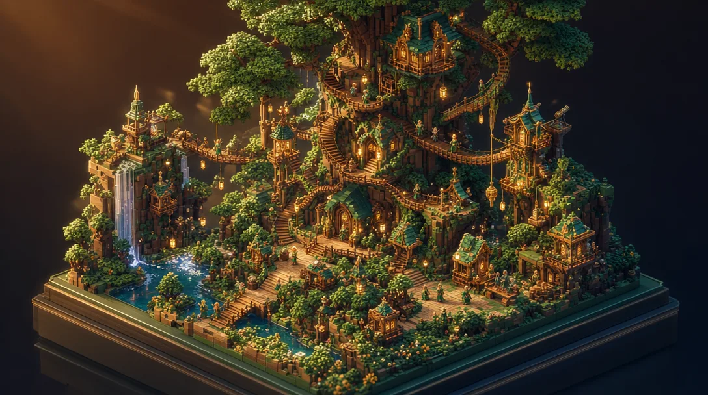

> A richly-detailed 3D ISOMETRIC DIORAMA, an OPEN-AIR OUTDOOR game world built out of smooth 3D BLOCKS of MIXED, NON-UNIFORM sizes — big chunky blocks for the large masses (walls, terrain, roofs) combined with many small blocks for fine detail (windows, props, foliage, trim). Characters and creatures are finely subdivided into MANY TINY BLOCKS with rounded, detailed, well-proportioned shapes — NOT big cubic Minecraft-style heads, avoid oversized square blocky heads, keep small smooth high-resolution multi-block figures. All clean smooth cube/box shapes with NO studs and NO bumps, sitting on a glossy pedestal base: a colossal world-tree village with spiral staircases, terraced treehouses, hanging bridges and tiny elf NPCs. Expansive outdoor scene with open sky and depth, dense intricate blocky build with lots of little blocks adding texture, varied block scale, dramatic CINEMATIC LIGHTING — warm golden-hour key light, glowing lanterns and light sources casting soft pools of light, bright rim light and gentle bloom, atmospheric god-rays, tilt-shift miniature feel, premium crisp studio render, main-hero level of detail. 16:9 widescreen composition. Cohesive forest-green and gold color grade, soft studio lighting, soft long shadows, dark premium background. No text, no price, no currency.

## lava-mines 

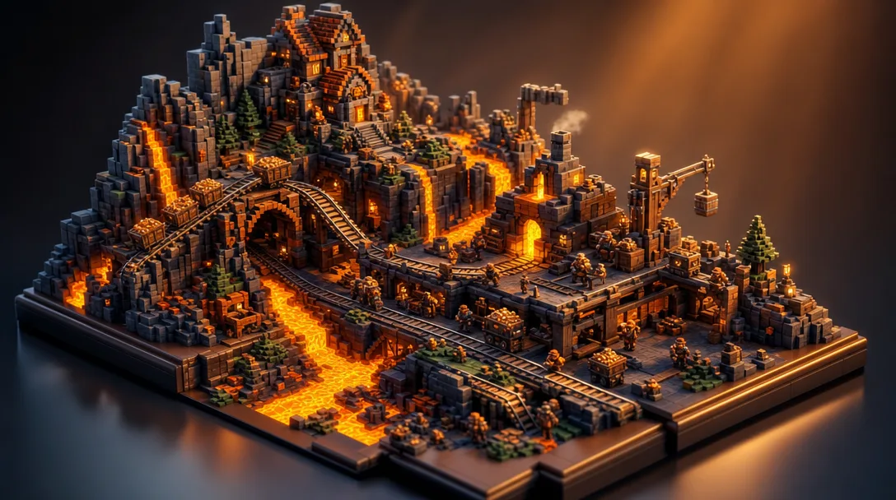

> A richly-detailed 3D ISOMETRIC DIORAMA, an OPEN-AIR OUTDOOR game world built out of smooth 3D BLOCKS of MIXED, NON-UNIFORM sizes — big chunky blocks for the large masses (walls, terrain, roofs) combined with many small blocks for fine detail (windows, props, foliage, trim). Characters and creatures are finely subdivided into MANY TINY BLOCKS with rounded, detailed, well-proportioned shapes — NOT big cubic Minecraft-style heads, avoid oversized square blocky heads, keep small smooth high-resolution multi-block figures. All clean smooth cube/box shapes with NO studs and NO bumps, sitting on a glossy pedestal base: a volcanic lava mining camp with molten lava rivers, minecart rails, a smelter and dwarf miners. Expansive outdoor scene with open sky and depth, dense intricate blocky build with lots of little blocks adding texture, varied block scale, dramatic CINEMATIC LIGHTING — warm golden-hour key light, glowing lanterns and light sources casting soft pools of light, bright rim light and gentle bloom, atmospheric god-rays, tilt-shift miniature feel, premium crisp studio render, main-hero level of detail. 16:9 widescreen composition. Cohesive orange and charcoal color grade, soft studio lighting, soft long shadows, dark premium background. No text, no price, no currency.

## hotspring-ryokan 

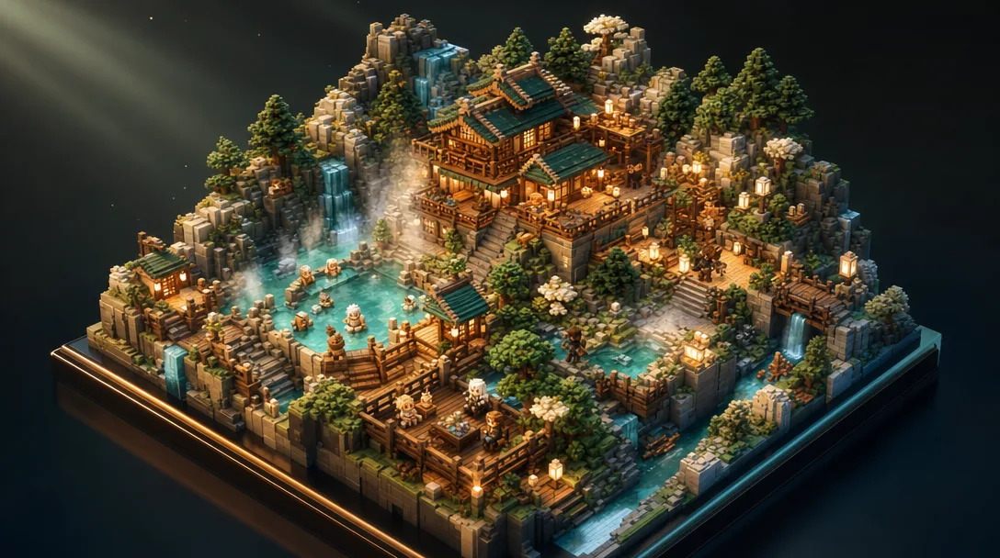

> A richly-detailed 3D ISOMETRIC DIORAMA, an OPEN-AIR OUTDOOR game world built out of smooth 3D BLOCKS of MIXED, NON-UNIFORM sizes — big chunky blocks for the large masses (walls, terrain, roofs) combined with many small blocks for fine detail (windows, props, foliage, trim). Characters and creatures are finely subdivided into MANY TINY BLOCKS with rounded, detailed, well-proportioned shapes — NOT big cubic Minecraft-style heads, avoid oversized square blocky heads, keep small smooth high-resolution multi-block figures. All clean smooth cube/box shapes with NO studs and NO bumps, sitting on a glossy pedestal base: a mountain hot-spring inn with steaming pools, paper lanterns, a wooden bathhouse and relaxing adventurers. Expansive outdoor scene with open sky and depth, dense intricate blocky build with lots of little blocks adding texture, varied block scale, dramatic CINEMATIC LIGHTING — warm golden-hour key light, glowing lanterns and light sources casting soft pools of light, bright rim light and gentle bloom, atmospheric god-rays, tilt-shift miniature feel, premium crisp studio render, main-hero level of detail. 16:9 widescreen composition. Cohesive jade and cream color grade, soft studio lighting, soft long shadows, dark premium background. No text, no price, no currency.

## fishing-pier 

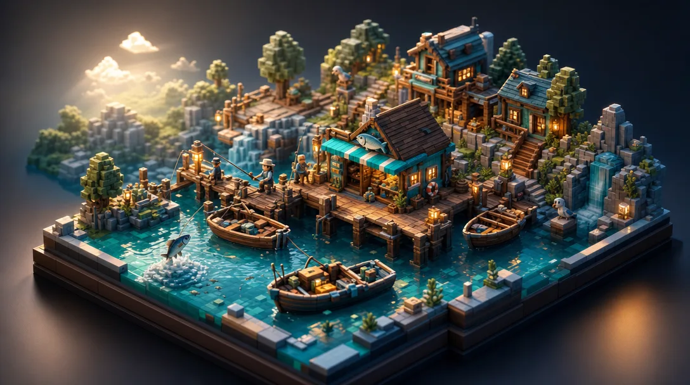

> A richly-detailed 3D ISOMETRIC DIORAMA, an OPEN-AIR OUTDOOR game world built out of smooth 3D BLOCKS of MIXED, NON-UNIFORM sizes — big chunky blocks for the large masses (walls, terrain, roofs) combined with many small blocks for fine detail (windows, props, foliage, trim). Characters and creatures are finely subdivided into MANY TINY BLOCKS with rounded, detailed, well-proportioned shapes — NOT big cubic Minecraft-style heads, avoid oversized square blocky heads, keep small smooth high-resolution multi-block figures. All clean smooth cube/box shapes with NO studs and NO bumps, sitting on a glossy pedestal base: a lakeside fishing pier village with rowboats, fishing rods, a bait shack and jumping fish. Expansive outdoor scene with open sky and depth, dense intricate blocky build with lots of little blocks adding texture, varied block scale, dramatic CINEMATIC LIGHTING — warm golden-hour key light, glowing lanterns and light sources casting soft pools of light, bright rim light and gentle bloom, atmospheric god-rays, tilt-shift miniature feel, premium crisp studio render, main-hero level of detail. 16:9 widescreen composition. Cohesive aqua and driftwood-brown color grade, soft studio lighting, soft long shadows, dark premium background. No text, no price, no currency.

## airship-deck 

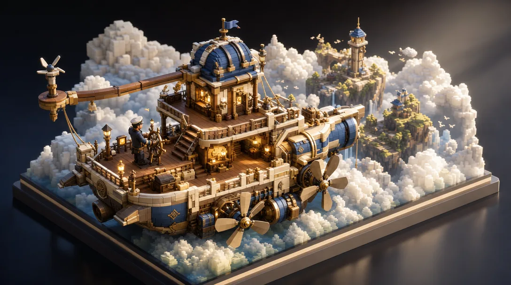

> A richly-detailed 3D ISOMETRIC DIORAMA, an OPEN-AIR OUTDOOR game world built out of smooth 3D BLOCKS of MIXED, NON-UNIFORM sizes — big chunky blocks for the large masses (walls, terrain, roofs) combined with many small blocks for fine detail (windows, props, foliage, trim). Characters and creatures are finely subdivided into MANY TINY BLOCKS with rounded, detailed, well-proportioned shapes — NOT big cubic Minecraft-style heads, avoid oversized square blocky heads, keep small smooth high-resolution multi-block figures. All clean smooth cube/box shapes with NO studs and NO bumps, sitting on a glossy pedestal base: an airship deck sailing above the clouds with propellers, rigging, a captain at the helm and distant floating isles. Expansive outdoor scene with open sky and depth, dense intricate blocky build with lots of little blocks adding texture, varied block scale, dramatic CINEMATIC LIGHTING — warm golden-hour key light, glowing lanterns and light sources casting soft pools of light, bright rim light and gentle bloom, atmospheric god-rays, tilt-shift miniature feel, premium crisp studio render, main-hero level of detail. 16:9 widescreen composition. Cohesive ivory and azure color grade, soft studio lighting, soft long shadows, dark premium background. No text, no price, no currency.

## mushroom-cavern 

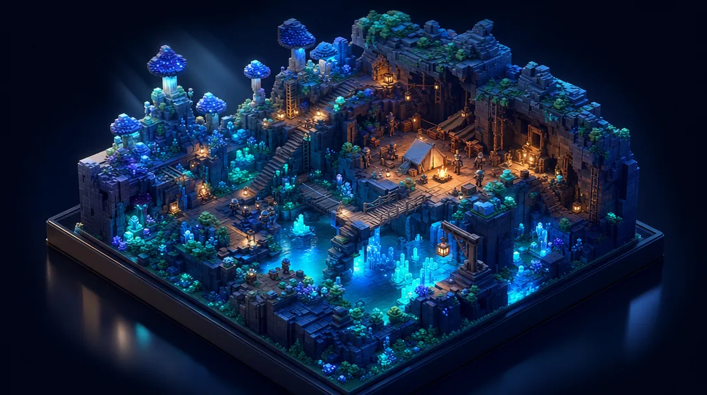

> A richly-detailed 3D ISOMETRIC DIORAMA, an OPEN-AIR OUTDOOR game world built out of smooth 3D BLOCKS of MIXED, NON-UNIFORM sizes — big chunky blocks for the large masses (walls, terrain, roofs) combined with many small blocks for fine detail (windows, props, foliage, trim). Characters and creatures are finely subdivided into MANY TINY BLOCKS with rounded, detailed, well-proportioned shapes — NOT big cubic Minecraft-style heads, avoid oversized square blocky heads, keep small smooth high-resolution multi-block figures. All clean smooth cube/box shapes with NO studs and NO bumps, sitting on a glossy pedestal base: an underground glowing mushroom cavern with luminous fungi, a hidden explorer camp and crystal pools. Expansive outdoor scene with open sky and depth, dense intricate blocky build with lots of little blocks adding texture, varied block scale, dramatic CINEMATIC LIGHTING — warm golden-hour key light, glowing lanterns and light sources casting soft pools of light, bright rim light and gentle bloom, atmospheric god-rays, tilt-shift miniature feel, premium crisp studio render, main-hero level of detail. 16:9 widescreen composition. Cohesive indigo and neon-teal color grade, soft studio lighting, soft long shadows, dark premium background. No text, no price, no currency.

## housing-garden 

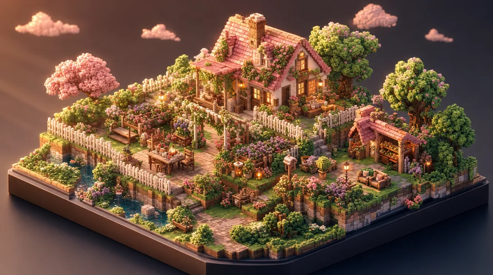

> A richly-detailed 3D ISOMETRIC DIORAMA, an OPEN-AIR OUTDOOR game world built out of smooth 3D BLOCKS of MIXED, NON-UNIFORM sizes — big chunky blocks for the large masses (walls, terrain, roofs) combined with many small blocks for fine detail (windows, props, foliage, trim). Characters and creatures are finely subdivided into MANY TINY BLOCKS with rounded, detailed, well-proportioned shapes — NOT big cubic Minecraft-style heads, avoid oversized square blocky heads, keep small smooth high-resolution multi-block figures. All clean smooth cube/box shapes with NO studs and NO bumps, sitting on a glossy pedestal base: a cozy player-housing garden with flower beds, a picket fence, a small cottage and decorative furniture. Expansive outdoor scene with open sky and depth, dense intricate blocky build with lots of little blocks adding texture, varied block scale, dramatic CINEMATIC LIGHTING — warm golden-hour key light, glowing lanterns and light sources casting soft pools of light, bright rim light and gentle bloom, atmospheric god-rays, tilt-shift miniature feel, premium crisp studio render, main-hero level of detail. 16:9 widescreen composition. Cohesive pastel-pink and sage color grade, soft studio lighting, soft long shadows, dark premium background. No text, no price, no currency.

## auction-plaza 

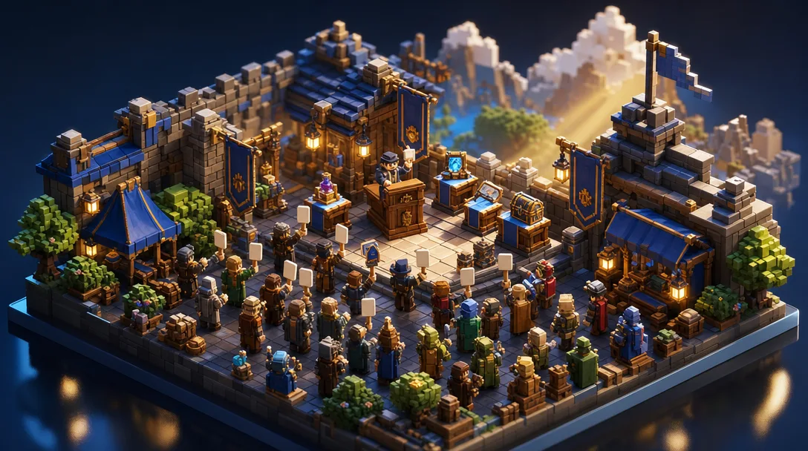

> A richly-detailed 3D ISOMETRIC DIORAMA, an OPEN-AIR OUTDOOR game world built out of smooth 3D BLOCKS of MIXED, NON-UNIFORM sizes — big chunky blocks for the large masses (walls, terrain, roofs) combined with many small blocks for fine detail (windows, props, foliage, trim). Characters and creatures are finely subdivided into MANY TINY BLOCKS with rounded, detailed, well-proportioned shapes — NOT big cubic Minecraft-style heads, avoid oversized square blocky heads, keep small smooth high-resolution multi-block figures. All clean smooth cube/box shapes with NO studs and NO bumps, sitting on a glossy pedestal base: an open-air auction plaza with a podium, blank bid paddles, display pedestals of rare loot and a bidding crowd. Expansive outdoor scene with open sky and depth, dense intricate blocky build with lots of little blocks adding texture, varied block scale, dramatic CINEMATIC LIGHTING — warm golden-hour key light, glowing lanterns and light sources casting soft pools of light, bright rim light and gentle bloom, atmospheric god-rays, tilt-shift miniature feel, premium crisp studio render, main-hero level of detail. 16:9 widescreen composition. Cohesive royal-blue and brass color grade, soft studio lighting, soft long shadows, dark premium background. No text, no price, no currency.

## pet-ranch 

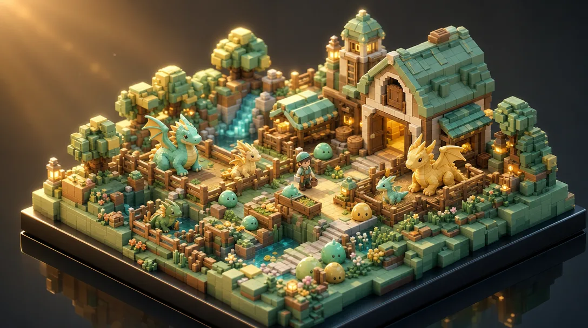

> A richly-detailed 3D ISOMETRIC DIORAMA, an OPEN-AIR OUTDOOR game world built out of smooth 3D BLOCKS of MIXED, NON-UNIFORM sizes — big chunky blocks for the large masses (walls, terrain, roofs) combined with many small blocks for fine detail (windows, props, foliage, trim). Characters and creatures are finely subdivided into MANY TINY BLOCKS with rounded, detailed, well-proportioned shapes — NOT big cubic Minecraft-style heads, avoid oversized square blocky heads, keep small smooth high-resolution multi-block figures. All clean smooth cube/box shapes with NO studs and NO bumps, sitting on a glossy pedestal base: a monster pet ranch with slimes, baby dragons, feeding troughs, a barn and a caretaker. Expansive outdoor scene with open sky and depth, dense intricate blocky build with lots of little blocks adding texture, varied block scale, dramatic CINEMATIC LIGHTING — warm golden-hour key light, glowing lanterns and light sources casting soft pools of light, bright rim light and gentle bloom, atmospheric god-rays, tilt-shift miniature feel, premium crisp studio render, main-hero level of detail. 16:9 widescreen composition. Cohesive mint and butter-yellow color grade, soft studio lighting, soft long shadows, dark premium background. No text, no price, no currency.

## rune-portal-hub 

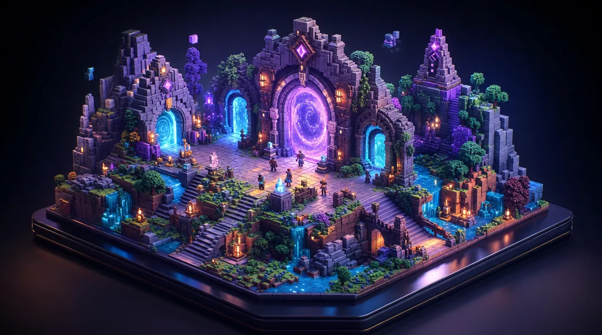

> A richly-detailed 3D ISOMETRIC DIORAMA, an OPEN-AIR OUTDOOR game world built out of smooth 3D BLOCKS of MIXED, NON-UNIFORM sizes — big chunky blocks for the large masses (walls, terrain, roofs) combined with many small blocks for fine detail (windows, props, foliage, trim). Characters and creatures are finely subdivided into MANY TINY BLOCKS with rounded, detailed, well-proportioned shapes — NOT big cubic Minecraft-style heads, avoid oversized square blocky heads, keep small smooth high-resolution multi-block figures. All clean smooth cube/box shapes with NO studs and NO bumps, sitting on a glossy pedestal base: a rune portal gateway hub with glowing arcane portals, stone arches and travelers stepping through. Expansive outdoor scene with open sky and depth, dense intricate blocky build with lots of little blocks adding texture, varied block scale, dramatic CINEMATIC LIGHTING — warm golden-hour key light, glowing lanterns and light sources casting soft pools of light, bright rim light and gentle bloom, atmospheric god-rays, tilt-shift miniature feel, premium crisp studio render, main-hero level of detail. 16:9 widescreen composition. Cohesive deep-purple and cyan color grade, soft studio lighting, soft long shadows, dark premium background. No text, no price, no currency.

## fireworks-festival 

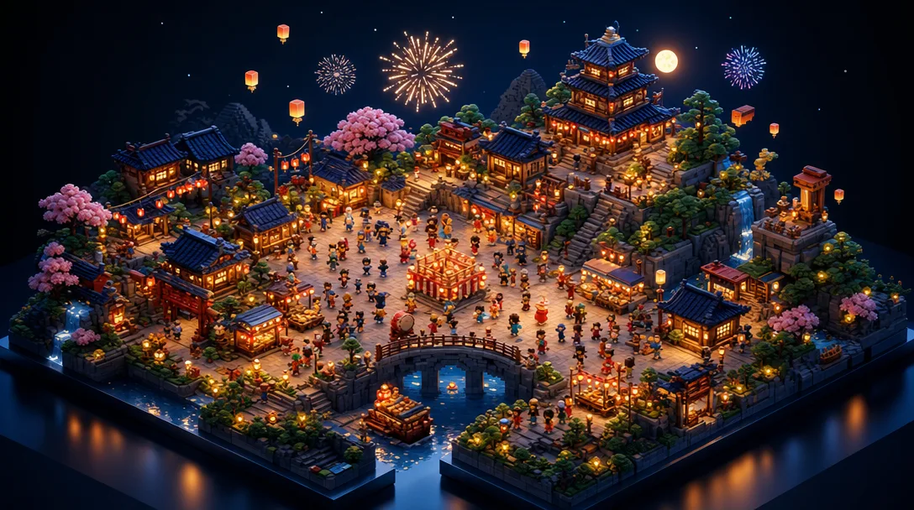

> A richly-detailed 3D ISOMETRIC DIORAMA, an OPEN-AIR OUTDOOR game world built out of smooth 3D BLOCKS of MIXED, NON-UNIFORM sizes — big chunky blocks for the large masses (walls, terrain, roofs) combined with many small blocks for fine detail (windows, props, foliage, trim). Characters and creatures are finely subdivided into MANY TINY BLOCKS with rounded, detailed, well-proportioned shapes — NOT big cubic Minecraft-style heads, avoid oversized square blocky heads, keep small smooth high-resolution multi-block figures. All clean smooth cube/box shapes with NO studs and NO bumps, sitting on a glossy pedestal base: a night festival plaza with blooming fireworks, paper lanterns, food stalls and dancing villagers. Expansive outdoor scene with open sky and depth, dense intricate blocky build with lots of little blocks adding texture, varied block scale, dramatic CINEMATIC LIGHTING — warm golden-hour key light, glowing lanterns and light sources casting soft pools of light, bright rim light and gentle bloom, atmospheric god-rays, tilt-shift miniature feel, premium crisp studio render, main-hero level of detail. 16:9 widescreen composition. Cohesive midnight-blue and gold color grade, soft studio lighting, soft long shadows, dark premium background. No text, no price, no currency.

## siege-battle 

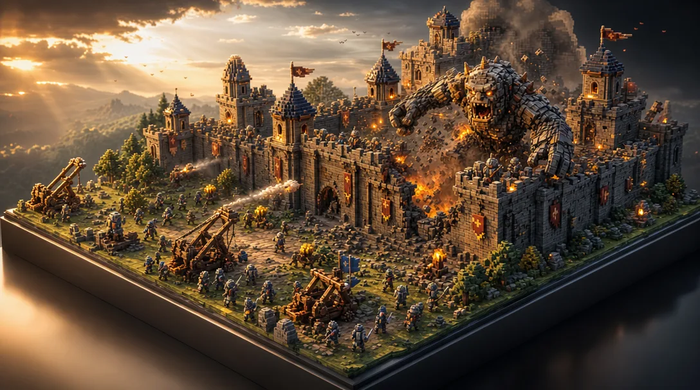

> A richly-detailed 3D ISOMETRIC DIORAMA, an OPEN-AIR OUTDOOR game world built out of smooth 3D BLOCKS of MIXED, NON-UNIFORM sizes — big chunky blocks for the large masses (walls, terrain, roofs) combined with many small blocks for fine detail (windows, props, foliage, trim). Characters and creatures are finely subdivided into MANY TINY BLOCKS with rounded, detailed, well-proportioned shapes — NOT big cubic Minecraft-style heads, avoid oversized square blocky heads, keep small smooth high-resolution multi-block figures. All clean smooth cube/box shapes with NO studs and NO bumps, sitting on a glossy pedestal base: a castle siege battle snapshot with a giant monster, catapults, charging knights and crumbling walls. Expansive outdoor scene with open sky and depth, dense intricate blocky build with lots of little blocks adding texture, varied block scale, dramatic CINEMATIC LIGHTING — warm golden-hour key light, glowing lanterns and light sources casting soft pools of light, bright rim light and gentle bloom, atmospheric god-rays, tilt-shift miniature feel, premium crisp studio render, main-hero level of detail. 16:9 widescreen composition. Cohesive steel-grey and flame-orange color grade, soft studio lighting, soft long shadows, dark premium background. No text, no price, no currency.
